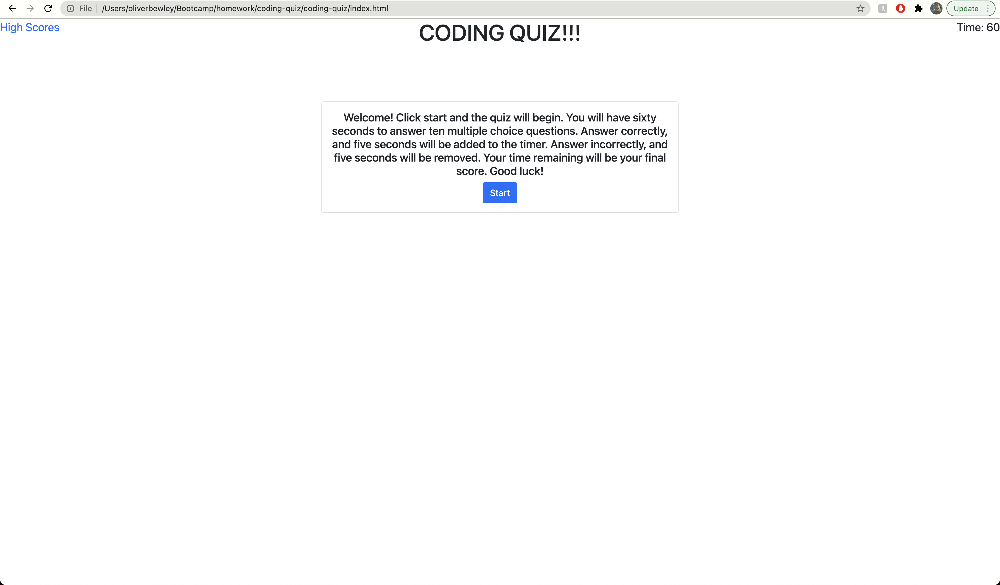

# coding-quiz

This is a basic quiz that asks the user questions relating to coding. While not as challenging as the password generator assignment, this one was still pretty tough. I had to dive deep into event listeners, local storage, and array sorting functions.

## Built With

- HTML
- CSS
- JavaScript 

## Usage

This Quiz is mostly just a demonstration of my ability to use the knowledge that I've gained so far in class.

